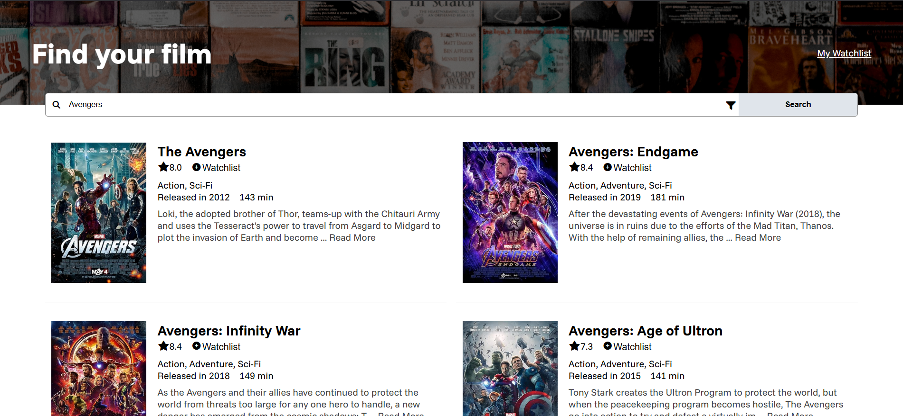
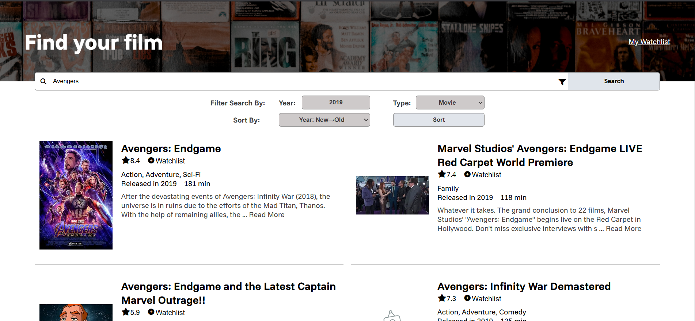
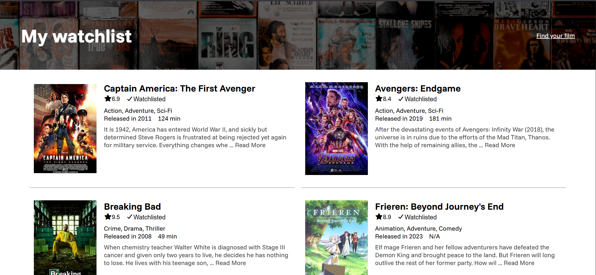
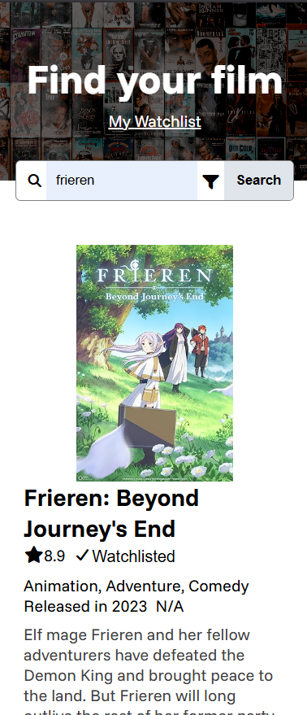
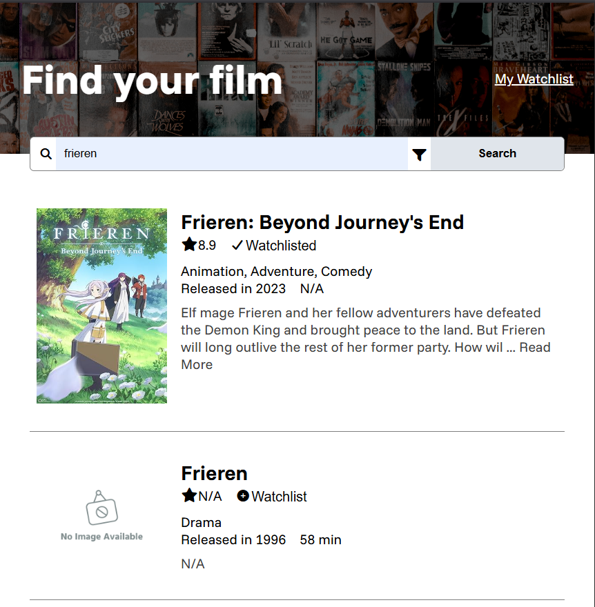

# Movie Watchlist
A webpage that provides a user interface for the user to access [OMDb API](https://www.omdbapi.com/), a RESTful web service to obtain movie information and savelist them into a personal watchlist.

## Features and Implementation
* A ***search bar*** that allows user's to search a film by its title.
* On returned search result, the user can click on ***Read More*** to expand the full film's description.

    

* A ***filter menu*** that allow user's to refine the search results by the released year and type (Movie, Series or Episode)
* The filter menu also allows the user to sort the returned search result by year, runtime and IMDB Rating.

    

* The user is allowed to save a searched movie title into ***a watchlist*** by clicking on the watchlist button next to the IMDB rating.

    

* 10 films will be rendered on a single page. To navigate to the next page of films, a ***navigation menu*** is at the bottom of each page.

    

* The webpage is designed using mobile-first design principle for ***Responsive Web Design***.

    
    

